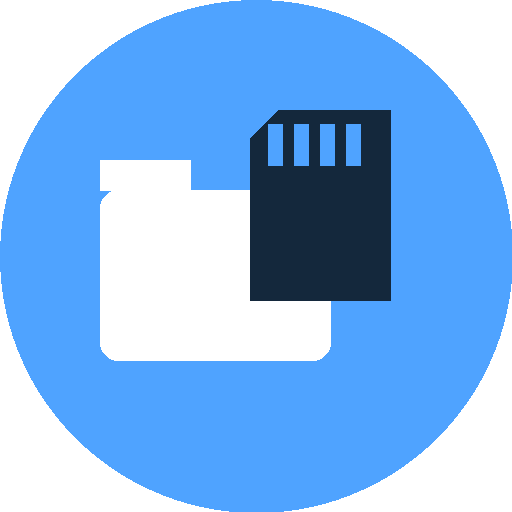
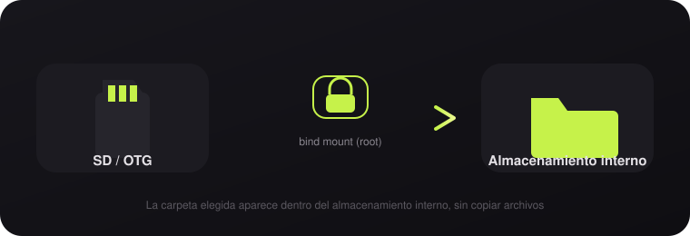
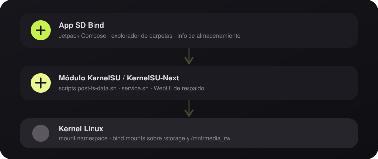

  

  # SD Bind

  **Vincula tarjetas SD y unidades OTG dentro del almacenamiento interno de tu Android — sin copiar archivos.**

  
  
  

 

## Qué es

**SD Bind** es un módulo de **KernelSU / KernelSU-Next** que crea *bind mounts*: monta
carpetas de una tarjeta SD o de una unidad USB (OTG) para que aparezcan **dentro** del
almacenamiento interno del teléfono, en la ruta que tú elijas. No se copia ni se mueve
nada — el contenido sigue físicamente en la SD/OTG, pero cualquier app lo ve como si
estuviera en el almacenamiento interno.

El proyecto trae dos formas de controlarlo:

- **App nativa** (`SD Bind Manager`, Jetpack Compose) — se instala sola junto con el
  módulo y ofrece un explorador de carpetas, anillos de uso de almacenamiento y gestión
  de vínculos con una interfaz Material You.
- **WebUI de respaldo** — la misma funcionalidad servida como página web, accesible
  desde el propio gestor de KernelSU si prefieres no instalar la app.

 

  

 

## Características

- 🔗 **Vínculos ilimitados** entre cualquier carpeta de SD/OTG y cualquier carpeta interna.
- 💾 **Anillos de almacenamiento** con el espacio libre/usado de cada unidad detectada.
- 📁 **Explorador integrado** para elegir origen y destino tocando `+`, sin escribir rutas.
- 🌓 **Material You** — colores y formas se adaptan al sistema, con tema claro/oscuro.
- 🧭 **Navegación flotante tipo "isla"** — la barra inferior difumina el contenido que
  tiene detrás en vez de taparlo con un fondo sólido.
- ♻️ **Persistencia entre reinicios** — los vínculos se vuelven a aplicar solos al
  arrancar el teléfono (`post-fs-data.sh` / `service.sh`).
- 🔄 **Autoactualización** — la app comprueba nuevas versiones y descarga el zip listo
  para flashear.
- 🌐 **Español / inglés** — interfaz localizada en ambos idiomas.

 

## Cómo está construido

  

- `app/` — app Android en Kotlin + Jetpack Compose (`com.sdcardbind.manager`).
- `module/` — módulo de KernelSU: scripts en `sh`, `mounts.conf` con los vínculos
  guardados, y `webroot/` con la WebUI de respaldo (HTML/CSS/JS puros, sin frameworks).
- `.github/workflows/build.yml` — compila el APK y empaqueta el zip del módulo
  automáticamente en cada push a `main`, sin necesidad de Android Studio.

 

## Compatibilidad

| Requisito | Detalle |
|---|---|
| Root | KernelSU o KernelSU-Next |
| Android | 10 o superior recomendado |
| Almacenamiento | Tarjeta SD y/o unidad OTG detectada por el sistema |

 

## Instalación (sin PC ni Android Studio)

1. **Crea una cuenta de GitHub** si no tienes una (gratis, en github.com).
2. Entra a github.com desde el navegador de tu teléfono → **New repository**
   (botón "+" arriba a la derecha) → dale cualquier nombre (ej.
   `sd-bind-manager`) → **Create repository**. Puede ser privado o público,
   no importa.
3. Dentro del repo recién creado, busca la opción **"uploading an existing
   file"** (aparece en la pantalla inicial del repo vacío) o **Add file →
   Upload files**.
4. Sube **todos los archivos y carpetas** de este proyecto manteniendo la
   misma estructura de carpetas (arrastra o selecciona todo el contenido
   descomprimido). Si tu navegador no te deja subir carpetas completas de
   una vez, sube el `.zip` completo a cualquier app de almacenamiento en la
   nube, ábrela con un explorador de archivos con función "extraer/comprimir"
   (por ejemplo *Material Files* o *ZArchiver*, gratis), y sube los archivos
   ya extraídos desde ahí — el navegador sí permite seleccionar múltiples
   archivos de una carpeta local.
5. Confirma la subida (**Commit changes**).
6. Ve a la pestaña **Actions** del repositorio. Debería aparecer un flujo
   llamado **"Build APK + módulo KSU"** corriendo automáticamente (tarda
   unos 3-6 minutos la primera vez).
7. Cuando termine (ícono verde ✔️), entra a esa ejecución y baja hasta
   **Artifacts** → descarga **`sdcard_bind_ui_con_app`**. Eso te da un
   `.zip` que contiene el zip real del módulo.
8. Extrae ese zip descargado (con Material Files/ZArchiver) — adentro está
   `sdcard_bind_ui_con_app.zip`, que es el que instalas en KernelSU-Next
   Manager → Módulos → Instalar.
9. Reinicia el teléfono. La app **SD Bind Manager** debería instalarse sola
   y aparecer en tu cajón de apps.

### Si algo falla en la compilación (Actions en rojo ❌)

Abre el log del paso que falló (aparece marcado) y pégamelo — lo más
común es que cambió la versión de alguna librería; se ajusta y vuelves
a subir el archivo corregido.

 

## Nota

El build que genera este workflow es un **APK "debug"** (autofirmado por
el propio proceso de compilación). Funciona perfectamente para uso
personal instalado directamente en tu teléfono; no está pensado para
publicarse en una tienda de apps.

  SD Bind · módulo <code>sdcard_bind_ui</code> · hecho para KernelSU / KernelSU-Next

