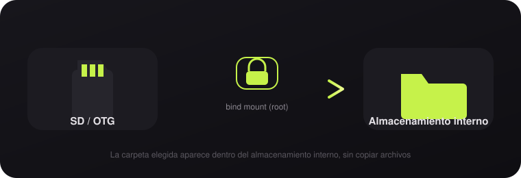
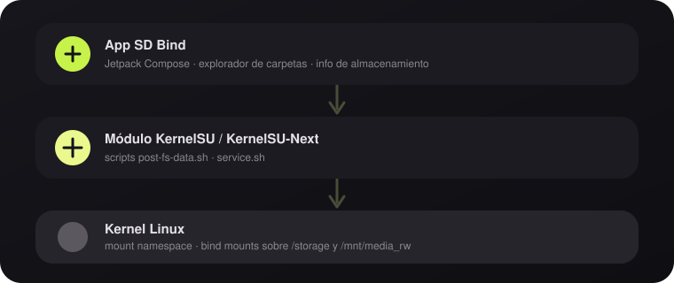

  

  # SD Bind

  **Vincula tarjetas SD y unidades OTG dentro del almacenamiento interno de tu Android — sin copiar archivos.**

  
  
  

 

## Qué es

**SD Bind** es un módulo de **KernelSU / KernelSU-Next** que crea *bind mounts*: monta
carpetas de una tarjeta SD o de una unidad USB (OTG) para que aparezcan **dentro** del
almacenamiento interno del teléfono, en la ruta que tú elijas. No se copia ni se mueve
nada — el contenido sigue físicamente en la SD/OTG, pero cualquier app lo ve como si
estuviera en el almacenamiento interno.

Se controla desde la **app nativa** (`SD Bind Manager`, Jetpack Compose + **Material 3
Expressive**): se instala sola junto con el módulo y ofrece explorador de carpetas, anillos
de uso de almacenamiento y gestión de vínculos.

 

  

 

## Características

- 🔗 **Vínculos ilimitados** entre cualquier carpeta de SD/OTG y cualquier carpeta interna.
- 💾 **Anillos de almacenamiento** con el espacio libre/usado de cada unidad detectada.
- 📁 **Explorador integrado** para elegir origen y destino tocando `+`, sin escribir rutas.
- 🌓 **Material 3 Expressive** — color dinámico (Material You), formas y movimiento expressive, tema claro/oscuro.
- 🧭 **Navegación Expressive** — barra inferior nativa, botón de acción extendido y deslizamiento entre pestañas.
- ♻️ **Persistencia entre reinicios** — los vínculos se vuelven a aplicar solos al
  arrancar el teléfono (`post-fs-data.sh` / `service.sh`).
- 🔄 **Autoactualización** — la app comprueba nuevas versiones y descarga el zip listo
  para flashear.
- 🌐 **Español / inglés** — interfaz localizada en ambos idiomas.

 

## Cómo está construido

  

- `app/` — app Android en Kotlin + Jetpack Compose (`com.sdcardbind.manager`).
- `module/` — módulo de KernelSU: scripts en `sh`, `mounts.conf` con los vínculos
  guardados.
- `.github/workflows/build.yml` — compila el APK y empaqueta el zip del módulo
  automáticamente en cada push a `main`, sin necesidad de Android Studio.

 

## Compatibilidad

| Requisito | Detalle |
|---|---|
| Root | KernelSU o KernelSU-Next |
| Android | 10 o superior recomendado |
| Almacenamiento | Tarjeta SD y/o unidad OTG detectada por el sistema |

 

  SD Bind · módulo <code>sdcard_bind_ui</code> · hecho para KernelSU / KernelSU-Next

